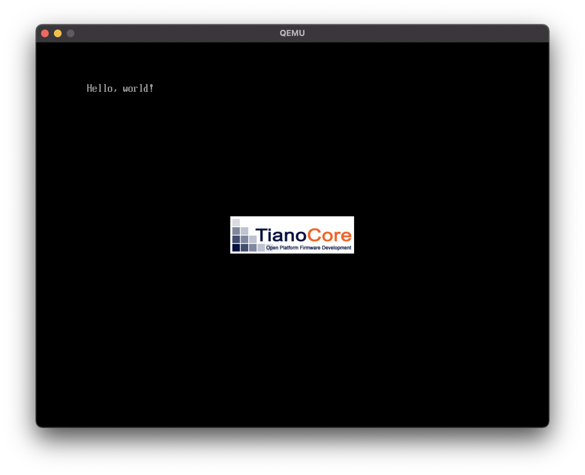

# 1章 PCの仕組みとハローワールド

* OSがない状態でコンピュータの画面にメッセージを表示してみるよ
* OSを使わないということは、コンピュータの生の機能をつかうということだよ
* コンピュータはデジタル回路でつくられていて 2 進数しか使えないのに、どうして文字が表示できるんだろう？
    * バイナリエディタを使ったプログラミングを通して、仕組みをかんたんに説明するよ。
        * その後で、C言語を使ったメッセージの表示をやり直してみるよ

---

[TOC]

---

## とりあえず hello world の efi つくって焼いていったりするよ

```bash
$ brew install qemu
...
$ qemu-img create -f raw disk.img 200M
Formatting 'disk.img', fmt=raw size=209715200
$ md5 disk.img                        
MD5 (disk.img) = 3566de3a97906edb98d004d6b947ae9b
$ brew install dosfstools
...
$ mkfs.fat -n 'MIKAN OS' -s 2 -f 2  -R 32 -F 32 disk.img
mkfs.fat 4.2 (2021-01-31)
$ md5 disk.img                                          
MD5 (disk.img) = 0867d991f6d3b13f6e84484e39a81cab
```

もっかい同じ事やったら disk.img の md5 が変わったので日付とかのメタインフォがはいっているんだろうな。

`qemu-img` で作成した `disk.img` をFATでフォーマットし、アタッチ。作成したバイナリを `/EFI/BOOT/BOOTX64.EFI/bootx64.efi` として配置後、デタッチ。

```bash
$ mkdir mnt -p
$ hdiutil attach -mountpoint mnt disk.img 
/dev/disk4  /Users/sanosei/github.com/say3no/try_mikanos/01/mnt
$ mkdir -p mnt/EFI/BOOT
$ cp bootx64.efi mnt/EFI/BOOT/BOOTX64.EFI
cp: bootx64.efi: could not copy extended attributes to mnt/EFI/BOOT/BOOTX64.EFI: Attribute not found
$ ls -hal mnt/EFI/BOOT/BOOTX64.EFI 
-rwxrwxrwx  1 sanosei  staff   1.5K  8 22 01:25 mnt/EFI/BOOT/BOOTX64.EFI*
$ hdiutil detach mnt
"disk4" ejected.
```

## OVMF ってなに

fdってなんだ？ フロッピーディスクか？ OVMFってなんだ？

```bash
$ curl -O https://raw.githubusercontent.com/uchan-nos/mikanos-build/master/devenv/OVMF_CODE.fd
$ md5 OVMF_CODE.fd 
MD5 (OVMF_CODE.fd) = 7e393c8d1e71ae63ba9ddcac2e04fe49

$ curl -O https://raw.githubusercontent.com/uchan-nos/mikanos-build/master/devenv/OVMF_VARS.fd
$ md5 OVMF_VARS.fd 
MD5 (OVMF_VARS.fd) = bb627eb9250889d6a5f80e27cb6f3cd5
```


>Open Virtual Machine Firmware (OVMF) は仮想マシンで UEFI を使えるようにするプロジェクトです。Linux 3.9 以上と新しいバージョンの QEMU では、グラフィックカードをパススルーすることが可能で、仮想マシンでネイティブと同じグラフィック性能を発揮することができます。
>
>デスクトップコンピュータに使用していない GPU が接続されている場合 (内蔵 GPU や古い OEM カードでもかまいません、ブランドが一致している必要はありません)、ハードウェアがサポートしていれば (#要件を参照)、あらゆる OS の仮想マシンで専用 GPU として（ほぼ）最大限の性能を活用できます。技術的な詳細は こちらのプレゼンテーション (pdf) を見てください。
>
> [OVMF による PCI パススルー - ArchWiki](https://wiki.archlinux.jp/index.php/OVMF_%E3%81%AB%E3%82%88%E3%82%8B_PCI_%E3%83%91%E3%82%B9%E3%82%B9%E3%83%AB%E3%83%BC)

## PCIパススルーってなに

なるほど。で PCIパススルーってなんだ？ PCIバスは分かる

https://wa3.i-3-i.info/word12714.html

>仮想マシンにおいて、ゲストOSから物理的なPCIデバイスへ直接アクセスするための仕組み。

仮想のゲストが物理のホストのリソースを触るために、ホストOSを経由しないようにできるもの？それってとっても危険な匂いがするような…。でもオーバーヘッドはガクッと減りそうね。

こういったオーバーヘッドをへらす取り組みというのは、準仮想化やらとかと近いものがあるのかしら。

VGAパススルーの要件は、下記。IOMMUってなんだ？

* 物理
  * CPUが ハードウェア仮想化(KVM)をサポートしている
    * Intel VT-x
  * マザーボードが IOMMU(パススルーをサポートしていること)
    * IOMMUってなんだ？
* 論理
  * ゲストOSのGPUROMがUEFIをサポートしていること

---

## IOMMU ってなに

Input/Output Memory Management Unit だとさ。DMA(Direct Memory Access)可能な IOバスとメインメモリを接続するメモリ管理ユニット…だとか。(https://ja.wikipedia.org/wiki/IOMMU)

IOMMUの話をするために、たんなる MMU を知らないといけない。 Memory Management Unit は物理部品の一つ。ざくっと仮想と物理のアドレスマップを管理するのが主要な役割のようだ。それに付随してメモリ保護機能やらキャッシュ制御、バス調停機能などがあるらしい。

たんなるMMUはCPUとMemoryの間で物理と仮想のマップを管理していた。IOMMUはDeviceとMemoryの間で物理と仮想のマップを管理しているのだろう。


ほか、 syuu1228 さんの記事もヒットした。このチームに居る限りにはいつか読もうと思ってまったく読めてない。ついでに読もうかな

https://syuu1228.github.io/howto_implement_hypervisor/part15.html

## いざ hello world

```bash
$ mkdir 01
$ qemu-system-x86_64 -drive if=pflash,file=./OVMF_CODE.fd -drive if=pflash,file=./OVMF_VARS.fd -hda disk.img
WARNING: Image format was not specified for './OVMF_CODE.fd' and probing guessed raw.
         Automatically detecting the format is dangerous for raw images, write operations on block 0 will be restricted.
         Specify the 'raw' format explicitly to remove the restrictions.
WARNING: Image format was not specified for './OVMF_VARS.fd' and probing guessed raw.
         Automatically detecting the format is dangerous for raw images, write operations on block 0 will be restricted.
         Specify the 'raw' format explicitly to remove the restrictions.
WARNING: Image format was not specified for 'disk.img' and probing guessed raw.
         Automatically detecting the format is dangerous for raw images, write operations on block 0 will be restricted.
         Specify the 'raw' format explicitly to remove the restrictions.
qemu-system-x86_64: qemu_mprotect__osdep: mprotect failed: Permission denied
```

Warning **いっぱいでたがとりあえずできたぜ**。ちなみに sudo つけても Permission denied でたのはなんでだ。



bgで動かして、 `lsof` とか `pmap` 見てみようぜ

ほえ〜〜。

```
$ lsof -p 64454 
COMMAND     PID    USER   FD   TYPE             DEVICE  SIZE/OFF                NODE NAME
qemu-syst 64454 sanosei  cwd    DIR               1,16       320             2163718 /Users/sanosei/github.com/say3no/try_mikanos/01
qemu-syst 64454 sanosei  txt    REG               1,16  13403216             2151788 /opt/homebrew/Cellar/qemu/6.0.0/bin/qemu-system-x86_64
qemu-syst 64454 sanosei  txt    REG               1,16     72256             2150881 /opt/homebrew/Cellar/vde/2.3.2_1/lib/libvdeplug.3.dylib
qemu-syst 64454 sanosei  txt    REG               1,16    374048             2150601 /opt/homebrew/Cellar/pixman/0.40.0/lib/libpixman-1.0.40.0.dylib
qemu-syst 64454 sanosei  txt    REG               1,16     70496             2132255 /opt/homebrew/Cellar/glib/2.68.4/lib/libgmodule-2.0.0.dylib
qemu-syst 64454 sanosei  txt    REG               1,16     94336             2150668 /opt/homebrew/Cellar/snappy/1.1.9/lib/libsnappy.1.1.9.dylib
qemu-syst 64454 sanosei  txt    REG               1,16    107920             2135741 /opt/homebrew/Cellar/libtasn1/4.17.0/lib/libtasn1.6.dylib
qemu-syst 64454 sanosei  txt    REG               1,16    159008             2142533 /opt/homebrew/Cellar/lzo/2.10/lib/liblzo2.2.dylib
qemu-syst 64454 sanosei  txt    REG               1,16    226304             2142200 /opt/homebrew/Cellar/libpng/1.6.37/lib/libpng16.16.dylib
qemu-syst 64454 sanosei  txt    REG               1,16    251440             2142088 /opt/homebrew/Cellar/jpeg/9d/lib/libjpeg.9.dylib
qemu-syst 64454 sanosei  txt    REG               1,16   1519664             2140013 /opt/homebrew/Cellar/gnutls/3.6.16/lib/libgnutls.30.dylib
qemu-syst 64454 sanosei  txt    REG               1,16    166992             2142268 /opt/homebrew/Cellar/libslirp/4.6.1/lib/libslirp.0.dylib
qemu-syst 64454 sanosei  txt    REG               1,16    110864             1331746 /opt/homebrew/Cellar/gettext/0.21/lib/libintl.8.dylib
qemu-syst 64454 sanosei  txt    REG               1,16   2547856 1152921500312767016 /usr/lib/dyld
qemu-syst 64454 sanosei  txt    REG               1,16   1854304             2132250 /opt/homebrew/Cellar/glib/2.68.4/lib/libgio-2.0.0.dylib
qemu-syst 64454 sanosei  txt    REG               1,16    362608             2132258 /opt/homebrew/Cellar/glib/2.68.4/lib/libgobject-2.0.0.dylib
qemu-syst 64454 sanosei  txt    REG               1,16   1247904             2132253 /opt/homebrew/Cellar/glib/2.68.4/lib/libglib-2.0.0.dylib
qemu-syst 64454 sanosei  txt    REG               1,16    159440             2142433 /opt/homebrew/Cellar/libusb/1.0.24/lib/libusb-1.0.0.dylib
qemu-syst 64454 sanosei  txt    REG               1,16    350016             2150526 /opt/homebrew/Cellar/ncurses/6.2/lib/libncursesw.6.dylib
qemu-syst 64454 sanosei  txt    REG               1,16    291632             2136018 /opt/homebrew/Cellar/nettle/3.7.3/lib/libnettle.8.4.dylib
qemu-syst 64454 sanosei  txt    REG               1,16    424128             2142350 /opt/homebrew/Cellar/libssh/0.9.5_1/lib/libssh.4.8.6.dylib
qemu-syst 64454 sanosei  txt    REG               1,16   1139728             2136218 /opt/homebrew/Cellar/p11-kit/0.24.0/lib/libp11-kit.0.dylib
qemu-syst 64454 sanosei  txt    REG               1,16    190528             2135529 /opt/homebrew/Cellar/libidn2/2.3.2/lib/libidn2.0.dylib
qemu-syst 64454 sanosei  txt    REG               1,16   1561984             2133276 /opt/homebrew/Cellar/libunistring/0.9.10/lib/libunistring.2.dylib
qemu-syst 64454 sanosei  txt    REG               1,16    316544             2136017 /opt/homebrew/Cellar/nettle/3.7.3/lib/libhogweed.6.4.dylib
qemu-syst 64454 sanosei  txt    REG               1,16    464208             2132648 /opt/homebrew/Cellar/gmp/6.2.1/lib/libgmp.10.dylib
qemu-syst 64454 sanosei  txt    REG               1,16    138288             2130250 /opt/homebrew/Cellar/libffi/3.3_3/lib/libffi.7.dylib
qemu-syst 64454 sanosei  txt    REG               1,16    288560             2130704 /opt/homebrew/Cellar/pcre/8.45/lib/libpcre.1.dylib
qemu-syst 64454 sanosei  txt    REG               1,16   2201104              603944 /opt/homebrew/Cellar/openssl@1.1/1.1.1k/lib/libcrypto.1.1.dylib
qemu-syst 64454 sanosei  txt    REG               1,16     36640             1463986 /Library/Preferences/Logging/.plist-cache.xe3P3Uf3
qemu-syst 64454 sanosei  txt    REG               1,16    240512              255970 /private/var/db/timezone/tz/2021a.1.0/icutz/icutz44l.dat
qemu-syst 64454 sanosei  txt    REG               1,16     87297             2186771 /private/var/db/analyticsd/events.whitelist
qemu-syst 64454 sanosei  txt    REG               1,16    136152 1152921500312198341 /System/Library/CoreServices/SystemAppearance.bundle/Contents/Resources/SystemAppearance.car
qemu-syst 64454 sanosei  txt    REG               1,16     71320 1152921500312198327 /System/Library/CoreServices/SystemAppearance.bundle/Contents/Resources/FauxVibrantDark.car
qemu-syst 64454 sanosei  txt    REG               1,16    268144 1152921500312767037 /usr/lib/libobjc-trampolines.dylib
qemu-syst 64454 sanosei  txt    REG               1,16  32436512 1152921500312778375 /usr/share/icu/icudt66l.dat
qemu-syst 64454 sanosei  txt    REG               1,16   6296632 1152921500312198317 /System/Library/CoreServices/SystemAppearance.bundle/Contents/Resources/DarkAqua.car
qemu-syst 64454 sanosei  txt    REG               1,16   5305704 1152921500312198345 /System/Library/CoreServices/SystemAppearance.bundle/Contents/Resources/VibrantDark.car
qemu-syst 64454 sanosei  txt    REG               1,16   2356684 1152921500312226858 /System/Library/Fonts/Helvetica.ttc
qemu-syst 64454 sanosei  txt    REG               1,16    228968 1152921500312198335 /System/Library/CoreServices/SystemAppearance.bundle/Contents/Resources/FunctionRowAppearance.car
qemu-syst 64454 sanosei  txt    REG               1,16    126168             1472522 /private/var/folders/gb/cy6n34xx13nfysmq8llscbs80000gn/C/com.apple.IntlDataCache.le.kbdx
qemu-syst 64454 sanosei  txt    REG               1,16   8285468 1152921500312226916 /System/Library/Fonts/SFNS.ttf
qemu-syst 64454 sanosei  txt    REG               1,16   6380584 1152921500312198307 /System/Library/CoreServices/SystemAppearance.bundle/Contents/Resources/Aqua.car
qemu-syst 64454 sanosei  txt    REG               1,16   1079048 1152921500312372188 /System/Library/Keyboard Layouts/AppleKeyboardLayouts.bundle/Contents/Resources/AppleKeyboardLayouts-L.dat
qemu-syst 64454 sanosei  txt    REG               1,16   5931008             2207938 /private/var/folders/gb/cy6n34xx13nfysmq8llscbs80000gn/0/com.apple.LaunchServices.dv/com.apple.LaunchServices-2548-v2.csstore
qemu-syst 64454 sanosei  txt    REG               1,16 159658712 1152921500312148911 /System/Library/CoreServices/CoreGlyphs.bundle/Contents/Resources/Assets.car
qemu-syst 64454 sanosei    0u   CHR               16,0   0t23304                 837 /dev/ttys000
qemu-syst 64454 sanosei    1u   CHR               16,0   0t23304                 837 /dev/ttys000
qemu-syst 64454 sanosei    2u   CHR               16,0   0t23304                 837 /dev/ttys000
qemu-syst 64454 sanosei    3   PIPE 0x8568f0ffa39a8ede     16384                     ->0xf1ef401e9eeb96d7
qemu-syst 64454 sanosei    4   PIPE 0xf1ef401e9eeb96d7     16384                     ->0x8568f0ffa39a8ede
qemu-syst 64454 sanosei    5   PIPE 0x3c3b12416c2f07bd     16384                     ->0xa4ca44c7495fefb8
qemu-syst 64454 sanosei    6   PIPE 0xa4ca44c7495fefb8     16384                     ->0x3c3b12416c2f07bd
qemu-syst 64454 sanosei    7   PIPE 0x2c9783489b87f320     16384                     ->0xc9b89b85ea073b9b
qemu-syst 64454 sanosei    8   PIPE 0xc9b89b85ea073b9b     16384                     ->0x2c9783489b87f320
qemu-syst 64454 sanosei    9   PIPE 0x706e71a93390ed11     16384                     ->0x875a0218eaaba1fc
qemu-syst 64454 sanosei   10   PIPE 0x875a0218eaaba1fc     16384                     ->0x706e71a93390ed11
qemu-syst 64454 sanosei   11u   REG               1,16    540672             2175412 /Users/sanosei/github.com/say3no/try_mikanos/01/OVMF_VARS.fd
qemu-syst 64454 sanosei   12r   REG               1,16    165629             2171766 /Applications/Visual Studio Code.app/Contents/Frameworks/Electron Framework.framework/Versions/A/Resources/v8_context_snapshot.arm64.bin
qemu-syst 64454 sanosei   13u   REG               1,16 209715200             2174184 /Users/sanosei/github.com/say3no/try_mikanos/01/disk.img
qemu-syst 64454 sanosei   15u   REG               1,16   3653632             2175349 /Users/sanosei/github.com/say3no/try_mikanos/01/OVMF_CODE.fd
qemu-syst 64454 sanosei   25r   REG               1,16   6971247             2169874 /Applications/Visual Studio Code.app/Contents/Resources/app/node_modules.asar

~ 
$
```

pstree

```
$ pstree -p 64454
-+= 00001 root /sbin/launchd
 \-+= 56553 sanosei /Applications/Visual Studio Code.app/Contents/MacOS/Electron
   \-+- 56639 sanosei /Applications/Visual Studio Code.app/Contents/Frameworks/Code Helper (Renderer).app/Contents/MacOS/Code Helper (Renderer) --type=renderer --disable-color-correct-rendering --field-trial-handle=1718379636,79156
     \-+- 56641 sanosei /Applications/Visual Studio Code.app/Contents/Frameworks/Code Helper (Renderer).app/Contents/MacOS/Code Helper (Renderer) /Applications/Visual Studio Code.app/Contents/Resources/app/out/bootstrap-fork --type
       \-+= 61477 sanosei /bin/zsh -l
         \--= 64454 sanosei qemu-system-x86_64 -drive if=pflash,file=./OVMF_CODE.fd -drive if=pflash,file=./OVMF_VARS.fd -hda disk.img

~ 
$ 

```

macosには pmap はなかった。かなしい。

### virsh list --all とか使いたいので libvirt 入れようぜ

https://www.arthurkoziel.com/running-virt-manager-and-libvirt-on-macos/

つかえるっぽいっすね。

```bash
$ brew install libvirt
$ date; virsh list --all
Sun Aug 22 19:17:35 JST 2021
 Id   Name   State
--------------------


~ 
$
```

しかし `virsh` ってのが `libvirt` とのインターフェースだって知識はあるんだけど、実際のところ `libvirt` が何を提供しているかってのはよくわかっていないんだな。
`virsh list --all` したら、今裏で動いている `helloworld` が list up されるかと思ったけど、そんなことはなかった。あれはたんに qemu ps でしかないもんね。

ということは、 `libvirt` に qemu を作らせて、  `pstree` した結果、その子要素に `qemu` がいるような状態にすれば、 さすがに `virsh list --all` で表示されるようね…？

そうであれば、 libvirt は xml や vm の状態などをどこに、どんなふうに管理しているんだろう？
`libvirt` を介して作成した `qemu` と、 直接 作成した `qemu` で、 `lsof -p ` の結果はどのように変わるのだろうか？

気になる。

### libvirt を介して vm をつくるために virsh でつかう xml を作成しようぜ
そのまえに、とりあえず Wikipedia の libvirt 読んでおこうぜ。

> libvirt とは、仮想化管理用の共通APIを提供する、レッドハットを中心としたオープンソースプロジェクトである。
> [libvirt - Wikipedia](https://ja.wikipedia.org/wiki/Libvirt)

なるほど。 virsh は libvirt client の一つに過ぎないわけですわな。さっき、

>しかし `virsh` ってのが `libvirt` とのインターフェースだって知識はあるんだけど、実際のところ `libvirt` が何を提供しているかってのはよくわかっていないんだな。

って書いたけど、これは解像度の粗い表現だった。libvirtは単に仮想化管理用の共通用のAPIを提供しているだけであって、それをコールするクライアントは別になんだっていいんだ。 virsh は、その一つに過ぎないんだな。 ほか、OpenStackは分かるけれど、 virt-manager と oVirt は僕はあまり聞かない。

>

ちなみに [libvirt-rust](https://github.com/libvirt/libvirt-rust) なるものがあるみたいっすね。

### virsh, OpenStack

かかなくていいや

### oVirt

> oVirt is an open-source distributed virtualization solution, designed to manage your entire enterprise infrastructure. oVirt uses the trusted KVM hypervisor and is built upon several other community projects, including libvirt, Gluster, PatternFly, and Ansible.
>
>[oVirt](https://www.ovirt.org/)

ふむ。分散仮想化とあるけどアーキテクチャはどうなっているんだろう。

#### [TODO] oVirt を触ってみる

触ってみようと思うんだけどoVirtは分散対応してるなら個人のlaptopで動かすには too much な感じするので優先度は低い。けど触ってみたいなあ。どんなアーキテクチャなんだろうね。ちょっと調べたらWebRESTAPIもあるみたいでした。

### kube-virt

wiki から引用した絵にはないけど、そのうちここに kube-virt も載ってくるんでしょうねえ。

### virt-manager

[Virtual Machine Manager Home](https://virt-manager.org/) 。

[Running virt-manager and libvirt on macOS](https://www.arthurkoziel.com/running-virt-manager-and-libvirt-on-macos/) によれば

```
❯ brew services start libvirt

==> Tapping homebrew/services
Cloning into '/opt/homebrew/Library/Taps/homebrew/homebrew-services'...
remote: Enumerating objects: 1399, done.
remote: Counting objects: 100% (278/278), done.
remote: Compressing objects: 100% (203/203), done.
remote: Total 1399 (delta 107), reused 213 (delta 70), pack-reused 1121
Receiving objects: 100% (1399/1399), 414.30 KiB | 2.24 MiB/s, done.
Resolving deltas: 100% (584/584), done.
Tapped 1 command (28 files, 509.9KB).
==> Successfully started `libvirt` (label: homebrew.mxcl.libvirt)

~ took 3s 
❯ virt-manager -c "qemu:///session" --no-fork
zsh: segmentation fault  virt-manager -c "qemu:///session" --no-fork

~ 
❯ 
```

セグフォってるやんけ〜〜〜〜
は〜〜〜俺は libvirt にわたす xml を楽して作りたかっただけなのになんで virt-manager も oVirt も macOS に入らねえんだよ〜〜〜

### libvirt の doc みながら 例のアレから xml を書き起こすか…

というわけで [libvirt: Domain XML format](https://libvirt.org/formatdomain.html) を読んでいこっかな…。やりたいのはこれだけなんすけどね。

```bash
qemu-system-x86_64 -drive if=pflash,file=./OVMF_CODE.fd -drive if=pflash,file=./OVMF_VARS.fd -hda disk.img
```

でググっていったら `virt-xml` ってのがあるのをしった。そりゃそうっすよね！ `virt-xml-validate` ってあるんですもんね！！！

```
❯ brew install virt-xml
Warning: No available formula or cask with the name "virt-xml". Did you mean virt-manager?
==> Searching for similarly named formulae...
This similarly named formula was found:
virt-manager
To install it, run:
  brew install virt-manager
==> Searching for a previously deleted formula (in the last month)...
Error: No previously deleted formula found.
==> Searching taps on GitHub...
Error: No formulae found in taps.

~ took 4s 
❯ 

```

はーうんちうんちうんち！！！

雛形の xml だけでもほしいので 自宅 k8s のUbuntuで virt-manager いれて virt-xml-edit でdumpしてみよ...
で見てみたんですけど すでに存在している domain の xml を編集するっていうニュアンスを感じ取れました、ああ辛い…

今度こそ [libvirt: Domain XML format](https://libvirt.org/formatdomain.html) を斜め読みました。すいません。
で、 https://libvirt.org/drvqemu.html#example-domain-xml-config に作例があってのでそれをいじっていこうと思います。